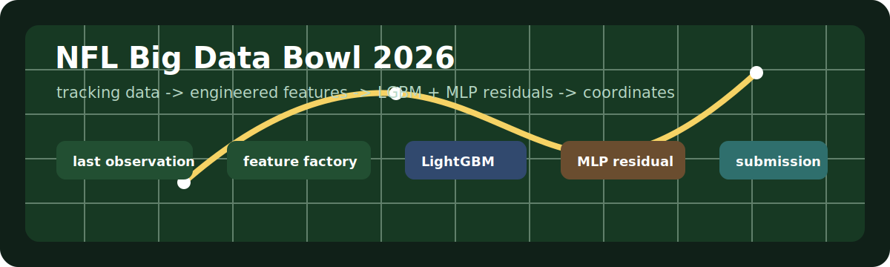
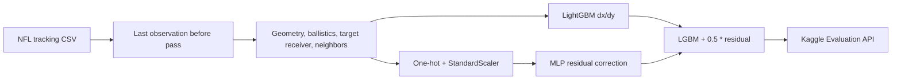

# NFL Big Data Bowl 2026 Prediction

<p align="center">
  
</p>


Kaggle-проект для **NFL Big Data Bowl 2026**: пайплайн предсказывает координаты игроков после паса по pre-throw tracking data. Основная идея решения - геометрические и баллистические признаки, LightGBM для базового смещения `dx/dy` и MLP-коррекция по остаткам.

## Что внутри

| Файл | Назначение |
| --- | --- |
| [0_604.py](0_604.py) | Основное решение с публичным LB около `0.604` |
| [0_694.py](0_694.py) | Более ранний baseline/вариант решения |
| [docs/pipeline.md](docs/pipeline.md) | Подробное описание data pipeline, feature engineering и inference |

## ML-пайплайн



## Ключевые идеи

- Последнее наблюдение до паса строится для каждого `(game_id, play_id, nfl_id)`.
- Добавлены lag-фичи движения: предыдущие координаты, скорость, ускорение, направление.
- Геометрия считается относительно точки приземления мяча и targeted receiver.
- Модель предсказывает не абсолютные координаты, а смещения `dx`, `dy` от последнего наблюдения.
- LightGBM работает как сильная базовая модель, MLP обучается на остатках.
- Inference повторяет тот же путь feature engineering через Kaggle Evaluation API.

## Стек

| Зона | Технологии |
| --- | --- |
| Data processing | Python, pandas, Polars, NumPy |
| Models | LightGBM, scikit-learn `MLPRegressor` |
| Features | kinematics, ball landing geometry, target receiver geometry, neighbor distances |
| Runtime | Kaggle Notebook / Kaggle Evaluation API |

## Как читать

1. Начните с [docs/pipeline.md](docs/pipeline.md) - там последовательно описан путь данных.
2. Откройте [0_604.py](0_604.py), если нужен код финального решения.
3. Сравните с [0_694.py](0_694.py), если интересна эволюция подхода.

## Ограничения

Датасет соревнования не хранится в репозитории. Скрипты ожидают Kaggle path:

```python
DATA_DIR = "/kaggle/input/nfl-big-data-bowl-2026-prediction"
```

Локально можно читать и анализировать код, но полный train/inference требует подключенного Kaggle dataset и evaluation server.
